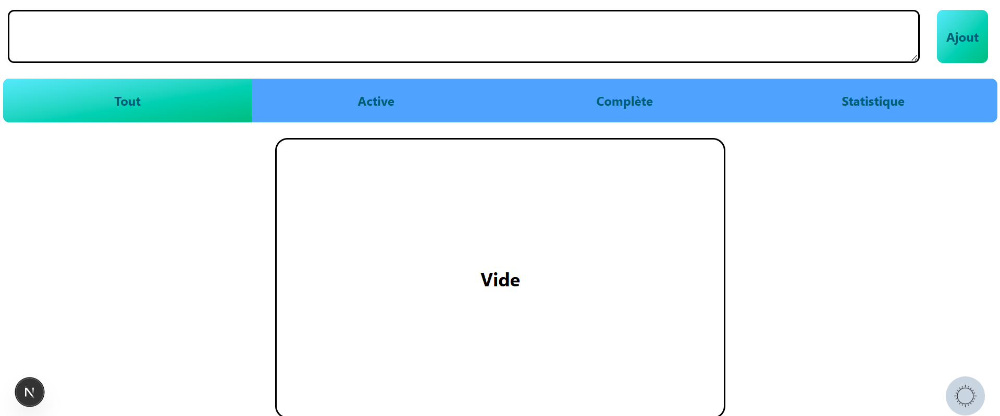
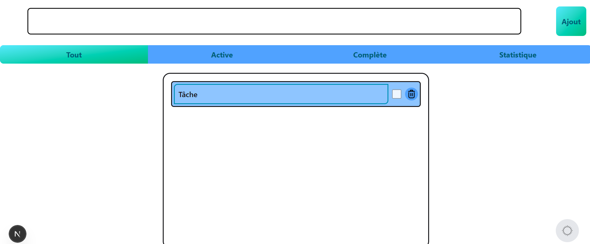
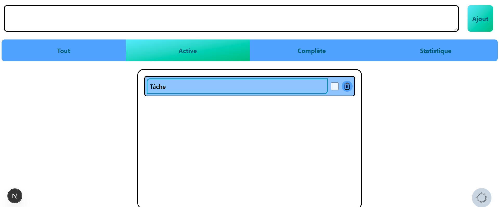

# نظام إدارة المهام

<div dir="rtl">
<a href="README_en.md">English</a> | <a href="README_fr.md">Français</a>
<br><br>
</div>

تطبيق حديث لإدارة المهام تم بناؤه باستخدام Next.js و React و Tailwind CSS و Framer Motion و DaisyUI.

## المميزات
- **إدارة المهام**: إنشاء وتحديث وتنظيم مهامك اليومية بكفاءة.
- **واجهة مستخدم حديثة**: واجهة نظيفة وبسيطة.
- **تصميم متجاوب**: مناسب للهواتف والأجهزة اللوحية وأجهزة الكمبيوتر.
- **حركة سلسة**: تجربة مستخدم محسنة مع حركة Framer Motion.
- **أداء سريع**: مبني على Next.js للسرعة.

## بدء الاستخدام

قم بتثبيت التبعيات:
```bash
npm install
```

قم بتشغيل خادم التطوير:
```bash
npm run dev
```

افتح [http://localhost:3000](http://localhost:3000) في متصفحك لمشاهدة النتيجة.

## التقنيات المستخدمة
- [Next.js](https://nextjs.org/)
- [React](https://reactjs.org/)
- [Tailwind CSS](https://tailwindcss.com/)
- [Framer Motion](https://www.framer.com/motion/)
- [DaisyUI](https://daisyui.com/)

## معاينة





