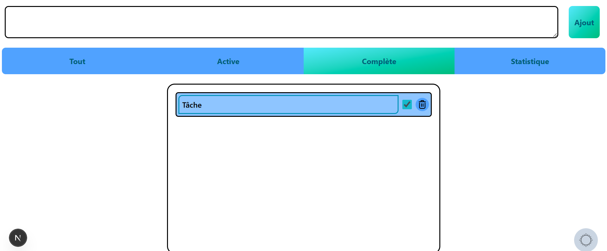
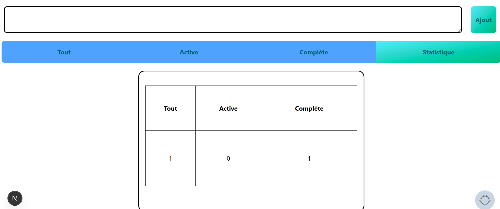

# Système de Gestion des Tâches

[English](README_en.md) | [العربية](README.md)

Un application moderne de gestion de tâches construite avec Next.js, React, Tailwind CSS, Framer Motion et DaisyUI.

## Fonctionnalités
- **Gestion des tâches** : Créez, mettez à jour et organisez vos tâches quotidiennes efficacement.
- **Interface Moderne** : Interface claire et intuitive.
- **Design Responsive** : Adaptable pour mobile, tablette et ordinateur.
- **Animation Fluide** : Expérience utilisateur améliorée avec animation de Framer Motion.
- **Performance** : Construit sur Next.js pour une vitesse optimale.

## Pour commencer

Installez les dépendances :
```bash
npm install
```

Lancez le serveur de développement :
```bash
npm run dev
```

Ouvrez [http://localhost:3000](http://localhost:3000) avec votre navigateur pour voir le résultat.

## Technologies utilisées
- [Next.js](https://nextjs.org/)
- [React](https://reactjs.org/)
- [Tailwind CSS](https://tailwindcss.com/)
- [Framer Motion](https://www.framer.com/motion/)
- [DaisyUI](https://daisyui.com/)

## Aperçu




